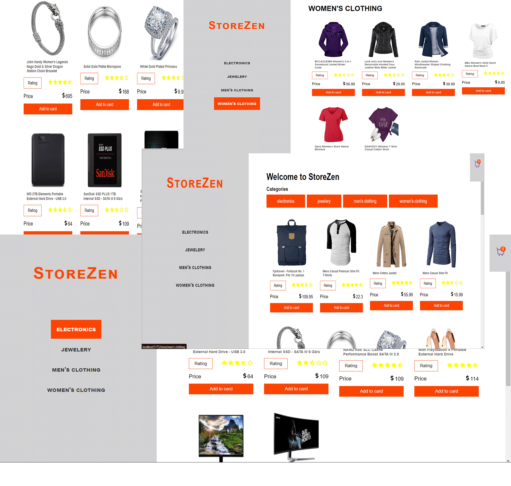

# Simple Application Developed While Learning React-Router-Dom new version

using new features such as 
- loaders
- actions
- fetchers 

Building navigation in a declarative approach is way more fun 😁😁😂.
For better routing of application and implement the fetch before load approach, react router is the best.
